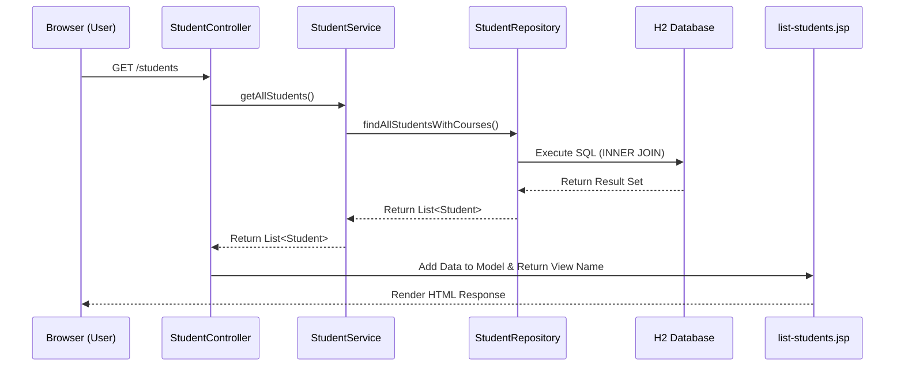

# Spring Boot CRUD Application: Student & Course Management

## 1. Project Overview & Explanation

This project is a Spring Boot application designed to manage a Many-to-One relationship between `Student` and `Course` entities. The goal is to provide a user-friendly interface that allows users to perform Create, Read, and Update (CRUD) operations on student records, linking them to specific courses.

The application follows the classic **Model-View-Controller (MVC)** architectural pattern:
*   **Model:** The Database layer and JPA Entities (`Student`, `Course`).
*   **View:** The JSP pages responsible for displaying the user interface.
*   **Controller:** The Spring MVC `StudentController` that routes incoming web requests, queries the Database via the Service layer, and returns the appropriate View.

The system uses an **in-memory H2 Database** to allow for quick testing and local execution without the need for an external database setup.

---

## 2. Flow and Structure of the Project

The application follows a straightforward multi-layered architecture to ensure clean separation of concerns:

### **Project Structure:**
*   `controller/`: Contains `StudentController.java`, managing the web traffic and endpoints (`/students`, `/students/new`, etc.).
*   `service/`: Contains `StudentService.java` and `CourseService.java`, acting as the business logic layer between the Controller and Repository.
*   `repository/`: Contains `StudentRepository.java` and `CourseRepository.java` (extending `JpaRepository`) for executing SQL queries.
*   `entity/`: Contains the `Student` and `Course` JPA classes.
*   `webapp/WEB-INF/jsp/`: Contains the visual interfaces (`list-students.jsp`, `add-student.jsp`, `edit-student.jsp`).

### **Data Flow:**
1.  **User Request:** The user navigates to `http://localhost:8080/students` in their browser.
2.  **Controller Routing:** The `StudentController` intercepts the `GET` request.
3.  **Service Processing:** The Controller calls `studentService.getAllStudents()`.
4.  **Database Query:** The `StudentService` calls `studentRepository.findAllStudentsWithCourses()`.
5.  **Data Retrieval:** The Repository executes an inner join SQL query on the H2 database, fetches the Student and linked Course data, and maps it back to Java Objects.
6.  **View Binding:** The Controller takes the List of Objects and binds it to the Spring `Model`.
7.  **Response to User:** The Controller returns the `list-students.jsp` page, which uses JSTL tags to render an HTML table containing the data and sends the final HTML page back to the user's browser.

**Visual Data Flow:**


---

## 3. Entity Relationship Design

The application manages information for two entities: `Student` and `Course`.
*   **Course:** Represents an academic course. It has attributes like `id`, `title`, and `credits`.
*   **Student:** Represents an enrolled student. It has attributes like `id`, `name`, and `email`.

**Relationship:**
A **One-to-Many** relationship exists between `Course` and `Student` (i.e., one course can have multiple students enrolled, but each student enrolls in a single course). 

**JPA Annotations Used:**
*   `@Entity`: Defines that the class is a JPA entity.
*   `@Id` and `@GeneratedValue`: Specifies the primary key and its generation strategy.
*   `@OneToMany(mappedBy = "course")`: Used in the `Course` entity to map the relationship.
*   `@ManyToOne(fetch = FetchType.LAZY)` and `@JoinColumn(name = "course_id")`: Used in the `Student` entity to define the foreign key.

---

## 4. Implementation Details for Operations

### Database & Setup
We use an in-memory **H2 Database** for ease of execution and testing. `DataLoader.java` uses `CommandLineRunner` to populate the database with 10 initial sample courses and 10 sample students when the application starts.

### Create Operation
*   **Implementation:** `add-student.jsp` contains an HTML form. `StudentController.java` handles the `GET` request to show the form (passing available courses) and a `POST` request to `addStudent(...)`. 
*   **Exception Handling:** `DataIntegrityViolationException` is caught in the controller to handle cases where a user tries to create a student with a duplicate email (due to the `unique = true` constraint on the email column). The user is shown an error message on the form.

### Read Operation
*   **Implementation:** The main list of students is displayed on `list-students.jsp`.
*   **Inner Join Custom Query:** The `StudentRepository.java` contains the custom method:
    ```java
    @Query("SELECT s FROM Student s JOIN FETCH s.course")
    List<Student> findAllStudentsWithCourses();
    ```
    This ensures that when students are fetched, their associated course data is fetched simultaneously via an INNER JOIN, preventing the N+1 query problem and improving performance. The `StudentController` calls `studentService.getAllStudents()` and binds the resulting list to the JSP view.

### Update Operation
*   **Implementation:** Each row in the student list has an "Edit" button. Clicking it calls `GET /students/edit/{id}`, which populates `edit-student.jsp` with the student's current data. Submitting the form triggers a `POST` to `/students/update/{id}`, where the `StudentController` updates the existing entity and saves it back to the database.

---

## 5. Testing

Unit tests were implemented using **JUnit** and **Mockito**:
*   `StudentRepositoryTest`: Uses `@DataJpaTest` and an embedded H2 database to verify that the custom inner join query (`findAllStudentsWithCourses`) returns the correct number of students and properly joins the course data.
*   `StudentServiceTest`: Uses Mockito (`@Mock`, `@InjectMocks`) to isolate the business logic and verify that `StudentService` correctly calls the corresponding repository methods for save, find by ID, and find all operations.

---

## 6. Challenges Faced & Solutions

*   **JSP Integration with Spring Boot:** Modern Spring Boot setups generally discourage JSP. To make JSP work, I had to ensure the project was packaged as a `war` and included the `tomcat-embed-jasper` and `jstl` dependencies in the `pom.xml`. Furthermore, I set the appropriate View Resolver configurations (`spring.mvc.view.prefix` and `suffix`) in `application.properties`.
*   **Handling the N+1 Query Problem:** By default, JPA might load the `Student` entities but issue separate queries for each student's `Course`. I overcame this by writing a custom `@Query` with `JOIN FETCH`, forcing JPA to load both entities in a single inner join query.
*   **Data Integrity on Update/Create:** Updating a student's email to an email that already exists throws an exception at the database level. I caught the `DataIntegrityViolationException` inside the controller to gracefully reload the form and inform the user of the error, rather than showing a generic server error page.

---

## 7. GitHub URL
[https://github.com/Thanushri23/Student-Course-Management](https://github.com/Thanushri23/Student-Course-Management)

---
*(Note: Please attach screenshots of the Home List View, Add View, and Edit View to this PDF before your final submission.)*
